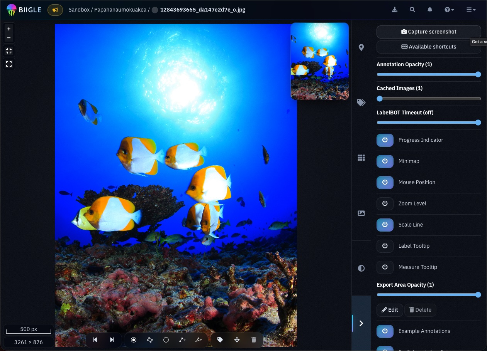
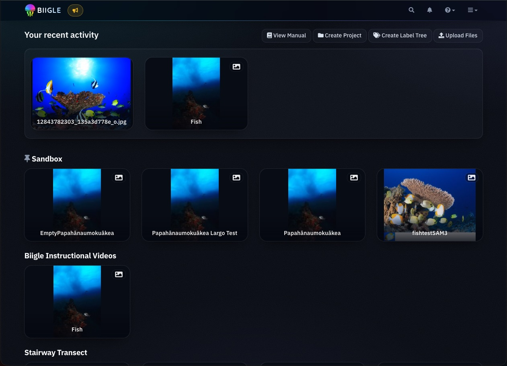
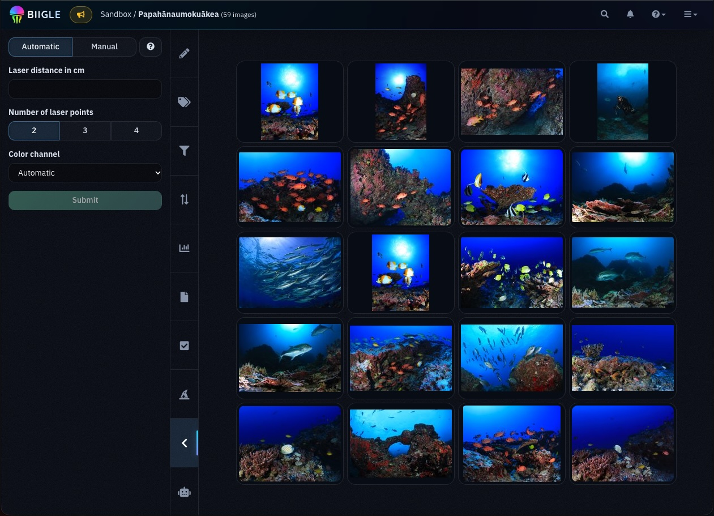
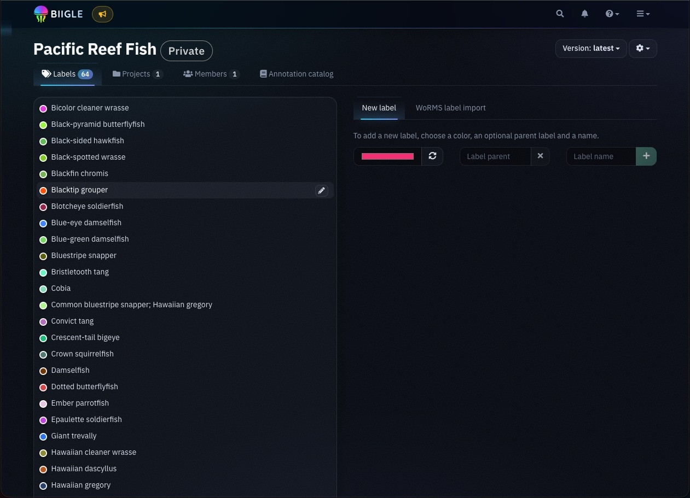
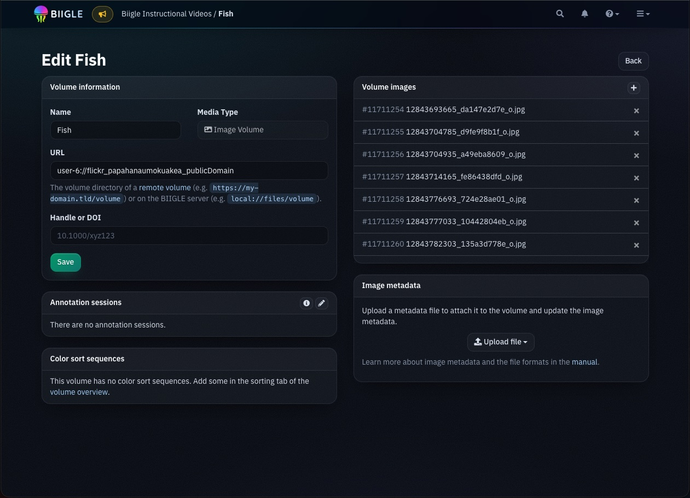

# Glass Theme

An optional alternative look for the BIIGLE web interface, packaged as a userscript. It applies a dark theme with translucent ("glass") surfaces, gradient accents, rounded cards and a few optional animations.

The theme only changes how BIIGLE looks in your own browser. It does not change any data or functionality, and it does not affect other users. You can switch it off at any time and return to BIIGLE's default appearance.



## Screenshots

| Dashboard | Volume overview |
|---|---|
|  |  |
| **Label tree** | **Volume settings** |
|  |  |

## Installation

The theme runs in a userscript manager browser extension. We recommend [Violentmonkey](https://violentmonkey.github.io/), which is free and open source.

1. Install Violentmonkey for your browser:
   - [Chrome, Edge, Brave and other Chromium-based browsers](https://chromewebstore.google.com/detail/violentmonkey/jinjaccalgkegednnccohejagnlnfdag)
   - [Firefox](https://addons.mozilla.org/firefox/addon/violentmonkey/)
2. Open the [script file](https://raw.githubusercontent.com/biigle/community-resources/master/glass-theme/glass-theme.user.js). Violentmonkey detects the userscript and shows an installation page.
3. Click **Install**.
4. Reload BIIGLE.

Violentmonkey checks for new versions of the script automatically.

**Chromium-based browsers:** Recent versions require you to allow userscripts for the extension. If the theme does not appear, open the extension details of Violentmonkey (`chrome://extensions`) and enable **Allow user scripts** (or enable the developer mode, depending on your browser version).

**Other userscript managers:** The script also works with [Tampermonkey](https://www.tampermonkey.net/). On Safari, you can use the [Userscripts](https://github.com/quoid/userscripts) app; page transitions may not be available there.

**Other BIIGLE instances:** By default, the script runs on `biigle.de`. To use it with another BIIGLE instance, open the script in your userscript manager and add a line like `// @match https://biigle.example.com/*` to the header.

## Usage

All settings are available in the menu of your userscript manager. In Violentmonkey, click the extension icon while BIIGLE is open. Your choices are saved and apply to all BIIGLE pages.

| Menu entry | Effect |
|---|---|
| Toggle theme | Switch the theme on or off. When off, BIIGLE uses its default appearance. |
| Toggle transitions | Animations between pages and when opening or closing sidebars. |
| Toggle message toasts | Animated messages with a countdown bar until they close. |
| Toggle click ripples | A light ripple where you click a button. |
| Toggle background drift | A slow movement of the background glow (not shown in the annotation tools). |
| Toggle input glow | A light running along the border of the focused text field. |
| Toggle tab highlight | A highlight that follows the mouse across tabs. |
| Toggle grid progress line | Replaces the scroll control of image grids (volume overview, Largo) with a thin line below the navigation bar. The grid can still be scrolled with the mouse wheel and the keyboard shortcuts (Home/End, Page Up/Page Down, arrow keys). |
| Toggle hidden sidebar scrollbars | Hides the scrollbars in sidebars. |
| Next accent colour | Abyss (cyan/indigo), Jellyfish (violet/pink), Kelp (green/cyan), Coral (amber/rose). |
| Next background | Midnight, Navy, Ink (almost black), Graphite (neutral grey, without blue tint). |
| Next text font | IBM Plex Sans, Roboto Slab, Inter, Nunito, Lexend or your system font. |
| Next logo font | Font of the "BIIGLE" logo in the navigation bar. |

### Focus mode

In the image and video annotation tools, press <kbd>Shift</kbd>+<kbd>Z</kbd> to dim everything except the image and the annotation toolbar. Move the mouse over a dimmed element to use it. Press <kbd>Shift</kbd>+<kbd>Z</kbd> again to leave the focus mode.

### Browser console

The settings can also be changed in the browser console with the `biigleGlass` object, for example:

```js
biigleGlass.background('graphite');
biigleGlass.accent('kelp');
biigleGlass.font('system');
biigleGlass.feature('drift', false);
biigleGlass.toggle(false);
```

## Notes

- **Fonts:** The theme loads its fonts from Google Fonts. If you prefer not to load resources from Google, choose the system font with "Next text font". The logo font is still loaded from Google Fonts.
- **Colour perception:** The default background has a slight blue tint. If you annotate colour-sensitive features, the neutral "Graphite" background may be a better choice.
- **Reduced motion:** If your operating system is set to reduce motion, the theme does not show any animations.
- **Browser support:** The theme is tested with current versions of Chromium-based browsers. Page transitions require a browser that supports cross-document view transitions (e.g. current Chrome or Edge).
- **Page transitions:** If page transitions do not appear, run `biigleGlass.diagnostics()` in the browser console after navigating to a new page. If `injectedInTime` is `false`, your userscript manager starts the script too late. Check its advanced settings for an option to inject scripts earlier.
- **BIIGLE updates:** The theme is based on the current structure of the BIIGLE web interface. After BIIGLE updates, parts of the theme may look different until the script is adjusted. If something does not work as expected, switch the theme off to check whether the issue is caused by the theme.

## Feedback

This script is maintained by the community and not by the BIIGLE developers. Please report issues with the theme in this repository and not in the BIIGLE issue tracker.
